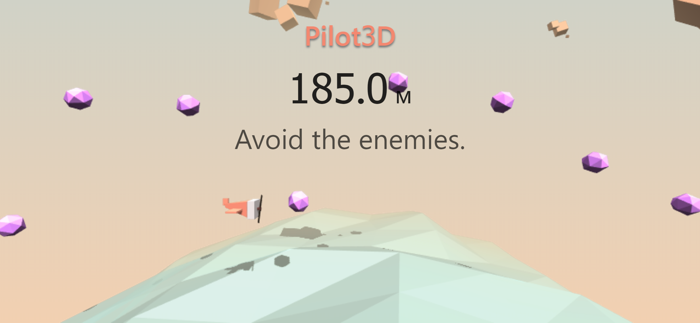
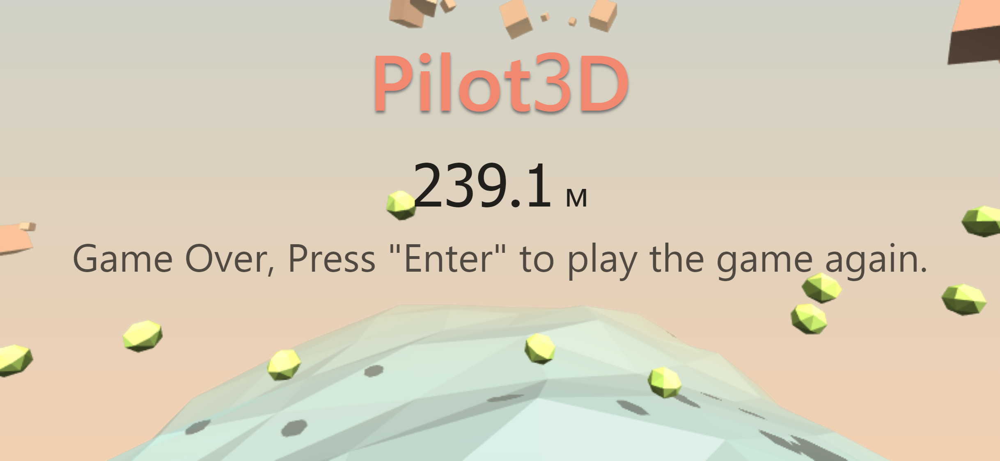

# Pilot3D

基于`three.js`、`WebGL`官网飞行员游戏动画场景

[在线预览 Live Demo](https://heskeybaozi.github.io/pilot-3d/)

> 参考 [The Making of “The Aviator”: Animating a Basic 3D Scene with Three.js](https://tympanus.net/codrops/2016/04/26/the-aviator-animating-basic-3d-scene-threejs/?utm_source=tuicool)

## Preview [Live Demo](https://heskeybaozi.github.io/pilot-3d/)





## How to run?

Clone this repository, install dependencies, and run start command.

克隆本仓库，安装依赖，运行启动命令

```bash
git clone https://github.com/HeskeyBaozi/pilot-3d
yarn install # or npm install
yarn start # or npm start
```

## 小组成员

何志宇、高阳、傅城钢、郭柱明、高欢宇

